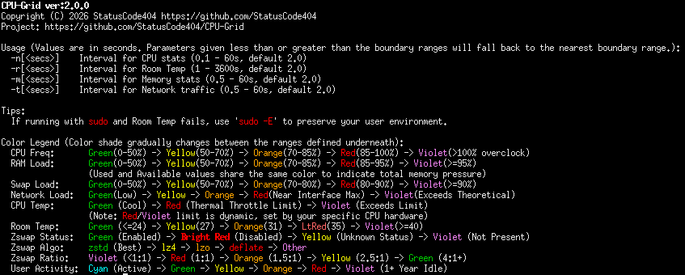

# CPU-Grid
## Running/Monitoring...
 

## Help (-h or --help)


## What is it?
CPU-Grid is a real-time, terminal-based system monitoring tool written in Rust. It provides a clean, color-coded overview of your system's performance, including CPU frequencies, hardware temperatures, memory utilization, Zswap metrics, network throughput, and user activity.

## Features

- **Real-time Monitoring**: Tracks per-core CPU frequency, RAM/Swap usage, hardware thermals, network speeds, and user idle time.
- **Smart Color-Coding**: Uses dynamic multi-stop color scaling to visually represent load, speed, and temperature intensity.
- **Advanced Memory & Zswap Insights**: Monitors individual swap device utilization, Zswap compression algorithms, pool statistics, and compression ratios to flag performance degradation.
- **Network & Event Tracking**: Monitors active Rx/Tx interface speeds against maximum throughput and dynamically logs interface connection/disconnection events.
- **User Activity Tracking**: Zero-dependency hardware-level idle tracker reading raw system inputs, with secure user-space Wayland/X11 DBus fallbacks.
- **Virtual Machine Awareness**: Gracefully detects VM guest environments and adjusts the UI to hide inaccessible hardware limits.
- **Room Temperature**: Integrates with temper-poll to display ambient room temperature, including dynamic text warnings if the room reaches critical heat levels.
- **Ultra-Lightweight & Safe**: Built with a multi-threaded architecture featuring zero-allocation data polling loops and strict thread cleanup for minimal CPU footprint and zero memory leaks. For reference: a Ryzen 5950x running CPU-Grid with 1 millisecond interval update for cpu frequencies ('-n 0.1' which is the minimum allowed) and cpu temperature readings, which is the hardest load you can apply to this program; registers 0% to 0.67% of one logical core usage using ~400KB-500KB of memory executing 24/7!
- **Squashable Grid**: Its primary design goal was to be able to show logical core frequencies, temperatures, memory & swap pressure, and networking all in a grid in the smallest shrunk terminal window possible with the least amount of resources used (scales down to 17 columns). The grid will reorient based on terminal window dimensions.

## Color Legend
Color shade gradually changes between the ranges defined underneath.

| Metric | Color Scale |
| :--- | :--- |
| **CPU Freq** | Green (0-50%) → Yellow (50-70%) → Orange (70-85%) → Red (85-100%) → Violet (≥100% overclock) |
| **CPU Temp** | Green (Cool) → Red (Thermal Limit) → Violet (Exceeds Limit) <br> (Note: Limit is dynamic, set by your specific hardware specs)|
| **Room Temp**| Green (≤24°C) → Yellow (27°C) → Orange (31°C) → LtRed (35°C) → Violet (≥40°C, triggers Warning) |
| **RAM Load** | Green (0-50%) → Yellow (50-70%) → Orange (70-85%) → Red (85-95%) → Violet (≥95%) |
| **Swap Load** | Green (0-50%) → Yellow (50-70%) → Orange (70-80%) → Red (80-90%) → Violet (≥90%) |
| **Network Load** | Green (Low) → Yellow → Orange → Red (Near Interface Max) → Violet (Exceeds Theoretical) |
| **Zswap Status** | Green (Enabled) → Bright Red (Disabled) → Yellow (Unknown) → Violet (Not Present) |
| **Zswap Algo** | Green (zstd) → Yellow (lz4) → Orange (lzo) → Red (deflate) → Violet (Other) |
| **Zswap Ratio** | Violet (<1:1) → Red (1:1) → Orange (1.5:1) → Yellow (2.5:1) → Green (4:1+) |
| **User Activity** | Cyan (Active) → Green → Yellow → Orange → Red → Violet (1+ Year Idle) |

## Requirements

- **OS**: Linux (Target strictly enforced at compile time. Requires access to /proc and /sys/class/hwmon).
- **Rust/Cargo**: Required to build from source.
- **Dependencies**: crossterm, which.
- **External (OPTIONAL)**: `temper-poll` must be installed and in your system PATH for ambient room temperature. Optional user-space fallback dependencies for user idle tracking: `busctl` (Wayland) or `xprintidle` (X11).

## Installation

1. Clone the repository:
   ```bash
   git clone [https://github.com/StatusCode404/CPU-Grid.git](https://github.com/StatusCode404/CPU-Grid.git)
   cd cpu-grid

2. Build the project:
   ```bash
   cargo build --release
   ```

3. Run the application:
   ```bash
   ./target/release/cpu_grid
   ```

## Usage
Values are in seconds. Parameters given less than or greater than the boundary ranges will fall back to the nearest boundary range.

| Flag | Description | Boundary Ranges |
| :--- | :--- | :--- |
| `-n <secs>` | Interval for CPU stats | 0.1 - 60s, default 2.0 |
| `-r <secs>` | Interval for Room Temp | 1 - 3600s, default 2.0 |
| `-m <secs>` | Interval for Memory stats | 0.5 - 60s, default 2.0 |
| `-t <secs>` | Interval for Network traffic | 0.5 - 60s, default 2.0 |

**Controls:**
- Press `Q` or `Ctrl+C` to cleanly terminate background threads and quit the application.

## License

Distributed under the GNU General Public License v3.0. See the `LICENSE` file for more information.
