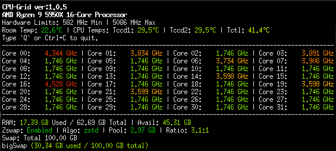

# CPU-Grid



CPU-Grid is a real-time, terminal-based system monitoring tool written in Rust. It provides a clean, color-coded overview of your system's performance, including CPU frequencies, hardware temperatures, memory utilization, and Zswap metrics.

## Features

- **Real-time Monitoring**: Tracks per-core CPU frequency, RAM/Swap usage, and hardware thermals.
- **Smart Color-Coding**: Uses dynamic color scaling to visually represent load and temperature intensity.
- **Zswap Insight**: Monitors Zswap compression and pool statistics (if enabled).
- **Room Temperature**: Integrates with `temper-poll` to display ambient room temperature.
- **Low Latency**: Built with a multi-threaded architecture for responsive updates.
- **Zero/Negligible Resource Footprint**: CPU-Grid shows '0' Core % usage. It has no effect on your use of the system. Memory use is ~500KB. On a Ryzen 5950x a 100 milisecond update parameter of "-n 0.1" (minimum for cpu interval) shows an approximate average range of 0.67% to 1.33% of one logical core and ~500KB use of memory running 24/7.
- **Squashable Grid**: It's primary design goal was to be able to show logical core frequencies, temperatures, and memory & swap pressure all in a grid in the smallest shrunk terminal window possible with the least amount of resources used.  The grid will reorient based on terminal window dimensions.

## Color Legend
Color shade gradually changes between the ranges defined underneath.

| Metric | Color Scale |
| :--- | :--- |
| **CPU Freq** | Green (0-50%) → Yellow (50-70%) → Orange (70-85%) → Red (85-100%) → Violet (>100%) |
| **RAM/Swap** | Green (0-50%) → Yellow (50-70%) → Orange (70-85%) → Red (85-100%) |
| **CPU Temp** | Green (Cool) → Red (Thermal Throttle/Critical Limit) |
| **Room Temp**| Green (≤24°C) → Yellow (25°C) → Orange (30°C) → LtRed (35°C) → DkRed (40°C) |
| **Zswap Satus** | Green (Enabled) -> Bright Red (Disabled) -> Yellow (Unknown Status) -> Dark Red (Not Present) |
| **Zswap Ratio** | Red (1:1) -> Orange (1.5:1) -> Yellow (2.5:1) -> Green (4:1+) |

## Requirements

- **OS**: Linux (Requires access to `/proc` and `/sys/class/hwmon` directories).
- **Rust/Cargo**: Required to build from source.
- **Dependencies**: `Crossterm`.
- **External**: `temper-poll` must be installed and in your system PATH for ambient room temperature.

## Installation

1. Clone the repository:
   ```bash
   git clone [https://github.com/StatusCode404/CPU-Grid.git](https://github.com/StatusCode404/CPU-Grid.git)
   cd cpu-grid
   ```

2. Build the project:
   ```bash
   cargo build --release
   ```

3. Run the application:
   ```bash
   ./target/release/cpu_grid
   ```

## Usage
Values are in seconds. Parameters given less than or greater than the boundary ranges will fall back to the nearest boundary range.

**Tips:**
  If running with sudo and Room Temp fails, use 'sudo -E' to preserve your user environment if temper-poll is only usable by the user and not sudo.

| Flag | Description | Default |
| :--- | :--- | :--- |
| `-n <secs>` | Interval for CPU stats | 0.1 - 60s, default 2.0 |
| `-r <secs>` | Interval for Room Temp | 1 - 3600s, default 2.0 |
| `-m <secs>` | Interval for Memory stats | 1 - 60s, default 2.0 |

**Controls:**
- Press `Q` or `Ctrl+C` to quit the application.

## License

Distributed under the GNU General Public License v3.0. See the `LICENSE` file for more information.
